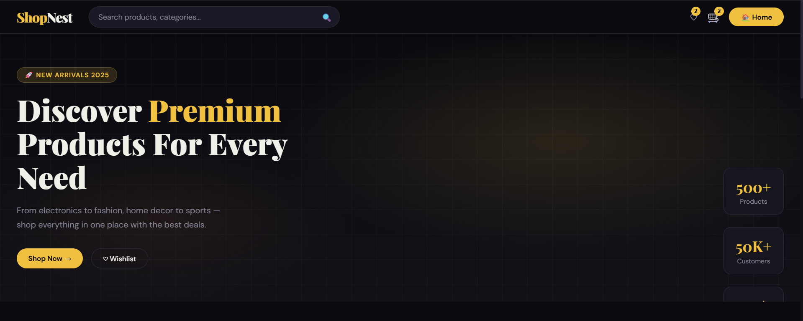
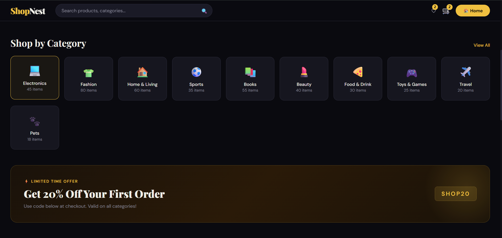

---

# 🛒 EcomEdge – Modern E-Commerce Landing Page


🔗 **Live Demo:** [https://ctt-vaishnavi.github.io/EcomEdge/](https://ctt-vaishnavi.github.io/EcomEdge/)
📂 **Repository:** [https://github.com/CTT-Vaishnavi/EcomEdge](https://github.com/CTT-Vaishnavi/EcomEdge)

---

## 🚀 Project Overview

**EcomEdge** is a sleek and modern **e-commerce landing page** built to simulate a real-world business platform.
It focuses on **clean UI, structured content, and conversion-oriented design**, which are key elements in modern web development.

This project demonstrates how a simple front-end stack can be used to build **professional, portfolio-ready websites**.

---

## 🎯 Key Highlights

✔️ Responsive design (Mobile + Desktop)
✔️ Clean and minimal UI
✔️ Business-focused layout
✔️ Smooth navigation experience
✔️ Structured sections like hero, features, testimonials

---

## 🖥️ Preview






---

## 🛠️ Tech Stack

| Technology | Usage                    |
| ---------- | ------------------------ |
| HTML5      | Page structure           |
| CSS3       | Styling & responsiveness |
| JavaScript | Interactivity            |

---

## 📂 Folder Structure

```bash
EcomEdge/
│── index.html
│── style.css
│── script.js
│── assets/
│── images/
```

---

## 💡 What I Learned

* Designing **real-world landing pages**
* Building **responsive layouts** using CSS
* Improving **UI/UX thinking**
* Structuring projects for **GitHub portfolio**

---

## 🔥 Why This Project Stands Out

Unlike basic static pages, this project focuses on:

* 💼 Real business use-case
* 🎯 Conversion-driven design
* 🧩 Organized and scalable structure

This makes it a strong addition to a **developer portfolio**, especially for front-end roles.

---

## 🚧 Future Enhancements

* 🔐 Login & Signup system
* 🛒 Add-to-cart functionality
* 🌐 Backend integration (Node.js / Firebase)
* ⚡ Advanced animations

---

## 👩‍💻 Author

**Vaishnavi Shinde**
💻 Computer Engineering Student | Web Developer

---
